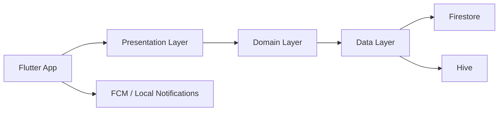

# CampusPulse

  
  
  
  


> Projet Flutter/Firebase réel présent dans ce dépôt. Ce README est basé sur l’analyse des fichiers actuellement disponibles, sans hypothèse supplémentaire.


## Table des matières

- [Présentation](#présentation)
- [Aperçu du problème résolu](#aperçu-du-problème-résolu)
- [Fonctionnalités observées](#fonctionnalités-observées)
- [Architecture](#architecture)
- [Structure du projet](#structure-du-projet)
- [Technologies utilisées](#technologies-utilisées)
- [Base de données et collections](#base-de-données-et-collections)
- [Notifications](#notifications)
- [Interface d’administration](#interface-dadministration)
- [Installation](#installation)
- [Configuration Firebase](#configuration-firebase)
- [Exécution](#exécution)
- [Déploiement](#déploiement)
- [Sécurité](#sécurité)
- [Tests](#tests)
- [Captures d’écran](#captures-décran)
- [Observations, incohérences et améliorations](#observations-incohérences-et-améliorations)
- [Roadmap](#roadmap)
- [Auteurs](#auteurs)
- [Licence](#licence)
- [Remerciements](#remerciements)

## Présentation

CampusPulse est une application Flutter orientée campus universitaire, avec une couche Firebase (Authentication, Firestore, Firebase Cloud Messaging) et une interface d’administration statique en HTML/CSS/JavaScript. Le dépôt contient actuellement :

- une application mobile Flutter pour les étudiants,
- une interface web d’administration dans le dossier `admin/`,
- des services Firebase orientés notifications, planification et logique métier.

Le code observable dans ce dépôt montre une application qui vise à centraliser :

- le planning des cours,
- les alertes de cours et rappels,
- le profil étudiant,
- les notifications locales et push.

## Aperçu du problème résolu

Le projet met en place une base fonctionnelle pour suivre l’activité universitaire et notifier les étudiants sur les changements de planning, les rappels et les événements de campus. Les services visibles dans le code montrent une volonté de minimiser les oublis de cours et d’informer les étudiants en temps réel via Firebase et notifications locales.

## Fonctionnalités observées

Les fonctionnalités réellement présentes dans le code sont les suivantes :

- authentification Firebase via `firebase_auth`,
- écran de connexion avec validation d’email et mot de passe,
- écran d’accueil / dashboard avec résumé du planning,
- consultation du planning hebdomadaire et journalier,
- consultation des détails d’un cours,
- page de profil avec informations utilisateur et préférences,
- notifications en lecture/lecture multiple,
- notifications locales via `flutter_local_notifications`,
- notifications push via `firebase_messaging`,
- abonnement à un topic `campus_notifications`,
- stockage local des préférences avec Hive,
- interface d’administration statique pour gestion des étudiants, cours et notifications,
- statistiques et activités récentes dans l’admin web.

## Architecture

Le projet suit une structure inspirée de la Clean Architecture, avec des couches visibles dans les dossiers `lib/features/*` :

- `data/` : sources de données Firestore, modèles et repositories,
- `domain/` : entités, use cases et abstractions des repositories,
- `presentation/` : pages, widgets, controllers et providers Riverpod.

La couche `lib/core/` contient les services transverses :

- `router/` : GoRouter (présent, mais non utilisé par l’écran principal actuel),
- `services/` : Hive, notifications locales, FCM, planning et rappels,
- `providers/` : providers de cache et réseau,
- `network/` : client Dio et constantes API.

### Diagramme de haut niveau



### Couche Data / Domain / Presentation

- Data Layer : `lib/features/*/data/`
- Domain Layer : `lib/features/*/domain/`
- Presentation Layer : `lib/features/*/presentation/`
- Core Layer : `lib/core/`

## Structure du projet

```text
.
├── admin/                          # Interface web d’administration
│   ├── css/
│   ├── firebase/
│   ├── js/
│   ├── services/
│   ├── index.html
│   ├── login.html
│   ├── dashboard.html
│   ├── students.html
│   ├── courses.html
│   ├── notifications.html
│   └── settings.html
├── android/                        # Configuration Android
├── ios/                            # Configuration iOS
├── lib/                            # Application Flutter principale
│   ├── core/
│   ├── features/
│   ├── firebase_options.dart
│   └── main.dart
├── test/                           # Tests Flutter
├── web/                            # Configuration web Flutter
├── pubspec.yaml                    # Dépendances et métadonnées
├── firebase.json                   # Config Firebase Flutter
└── README.md
```

## Technologies utilisées

| Technologie | Utilisation observée |
| --- | --- |
| Flutter | Application mobile principale |
| Dart | Code applicatif et tests |
| Firebase Auth | Connexion utilisateur |
| Cloud Firestore | Stockage des cours, notifications et profils |
| Firebase Cloud Messaging | Notifications push et topic `campus_notifications` |
| Riverpod | Gestion d’état dans les pages et controllers |
| Hive | Persistance locale des réglages et cache |
| flutter_local_notifications | Notifications locales |
| Dio | Client réseau de base |
| Go Router | Routage présent dans le dépôt |
| HTML / CSS / JavaScript | Interface web d’administration |
| Firebase Web SDK | Administration et intégration web |

## Base de données et collections

Les collections visibles dans le code sont les suivantes :

### `users/{uid}`

Champ observé dans le code et la configuration admin :

- `email`
- `firstName`
- `lastName`
- `studentNumber`
- `department`
- `program`
- `level`
- `photoUrl`
- `status`
- `role`

### `courses/{courseId}`

- `title`
- `room`
- `teacher`
- `start_time` ou `startTime`
- `end_time` ou `endTime`

### `notifications/{notificationId}`

- `id`
- `title`
- `body`
- `createdAt`
- `updatedAt`
- `type`
- `isRead`
- `courseId` (optionnel)

### `notificationDispatchQueue/{notificationId}`

- `notificationId`
- `title`
- `body`
- `type`
- `topic: campus_notifications`
- `status`

### `courseReminderQueue/{reminderId}`

- `courseId`
- `title`
- `body`
- `reminderAt`
- `status`

### `adminActivityLog/{itemId}`

- `action`
- `entity`
- `entityId`
- `details`
- `createdAt`

## Notifications

Le projet implémente plusieurs mécanismes de notification :

- notifications locales via `flutter_local_notifications`,
- notifications push via Firebase Cloud Messaging,
- stockage et lecture des notifications dans Firestore,
- rappels planifiés pour les cours,
- notifications liées à un cours ajouté, modifié, annulé, ou rappel quotidien.

Le code montre aussi des scénarios de notification spécifiques :

- nouveau cours,
- changement de salle,
- annulation de cours,
- rappel quotidien de planning.

## Interface d’administration

L’interface d’administration statique live dans `admin/` et propose :

- tableau de bord,
- gestion des étudiants,
- gestion des cours,
- gestion des notifications,
- paramètres et configuration Firebase,
- vérification du rôle admin via `users/{uid}.role` et `status`.

Les pages observées sont :

- `admin/dashboard.html`
- `admin/students.html`
- `admin/courses.html`
- `admin/notifications.html`
- `admin/settings.html`

## Installation

### Linux

```bash
flutter pub get
flutter run
```

### Windows

```powershell
flutter pub get
flutter run
```

### macOS

```bash
flutter pub get
flutter run
```

### Android

```bash
flutter pub get
flutter run -d android
```

### Interface web d’administration

```bash
cd admin
python3 -m http.server 8080
```

Puis ouvrir :

```text
http://localhost:8080/login.html
```

## Configuration Firebase

Pour faire fonctionner l’application et l’admin web, il faut :

1. créer un projet Firebase,
2. activer Firebase Authentication,
3. activer Firestore Database,
4. activer Firebase Cloud Messaging,
5. configurer les fichiers de configuration web et Flutter fournis par Firebase.

Le dépôt contient déjà une configuration de projet dans `firebase.json` et `lib/firebase_options.dart`.

## Exécution

### Application Flutter

```bash
flutter pub get
flutter run
```

### Administration web

```bash
cd admin
python3 -m http.server 8080
```

## Déploiement

### Flutter

Le projet est prêt pour un déploiement mobile standard Flutter, avec les fichiers Android/iOS déjà présents.

### Firebase Hosting

L’interface d’administration statique est conçue pour un déploiement sur Firebase Hosting, comme indiqué dans `admin/README.md`.

### Cloud Functions

Aucune Cloud Function n’est présente dans ce dépôt à l’état actuel. Les rappels et notifications push sont gérés dans le code client et dans la logique d’admin web, avec des files de traitement Firestore visibles (`notificationDispatchQueue`, `courseReminderQueue`).

## Sécurité

Les éléments sécuritaires observés dans le dépôt sont :

- authentification Firebase pour l’application mobile,
- contrôle de rôle admin sur `users/{uid}` dans l’admin web,
- règles Firestore d’exemple dans `admin/firestore.rules.example`,
- vérification de `status == 'active'` et `role == 'admin'` dans la logique d’admin.

À noter : les règles complètes de production ne sont pas présentes dans le dépôt ; seule la version d’exemple est fournie.

## Tests

Le projet contient un test de smoke minimal dans `test/widget_test.dart`.

Vérification effectuée dans cet environnement :

- `flutter test` → 1 test passé
- `flutter analyze` → aucune issue trouvée

## Captures d’écran

Aucune capture d’écran n’est actuellement présente dans le dépôt. Les emplacements à prévoir sont les suivants :

### Connexion


### Tableau de bord


### Planning


### Centre de notifications


### Profil


### Administration


## Observations, incohérences et améliorations

### Points observés

- Le dépôt contient une interface d’administration statique en HTML/JS, mais aucune Cloud Function.
- Le routage GoRouter est présent dans `lib/core/router/app_router.dart`, mais l’application principale utilise actuellement `AuthGate` comme écran racine.
- Les règles Firestore de production ne sont pas présentes ; seul un exemple est disponible.
- Le logo et les captures d’écran référencés dans ce README ne sont pas encore présents dans `docs/`.

### Points à améliorer

- ajouter les dossiers `docs/images/` et `docs/screenshots/`,
- finaliser les règles Firestore de production,
- documenter les collections Firestore réelles avec exemples de données,
- ajouter des tests métier au-delà du smoke test actuel,
- compléter la logique d’admin avec un backend sécurisé si les notifications push doivent être orchestrées automatiquement.

## Roadmap

1. Finaliser la documentation graphique et les assets visuels.
2. Ajouter un véritable système de règles Firestore en production.
3. Ajouter des tests d’intégration pour les écrans principaux.
4. Sécuriser les workflows de notifications et de rappel avec Cloud Functions.
5. Déployer l’admin web sur Firebase Hosting.
6. Ajouter une page de gestion complète des profils étudiants et des rôles.

## Auteurs

Aucun auteur nommé n’est explicitement déclaré dans ce dépôt.

## Licence

Aucune licence n’est déclarée dans ce dépôt actuellement.

## Remerciements

Merci à l’écosystème Flutter, Firebase et Dart pour les composants utilisés dans ce projet.

